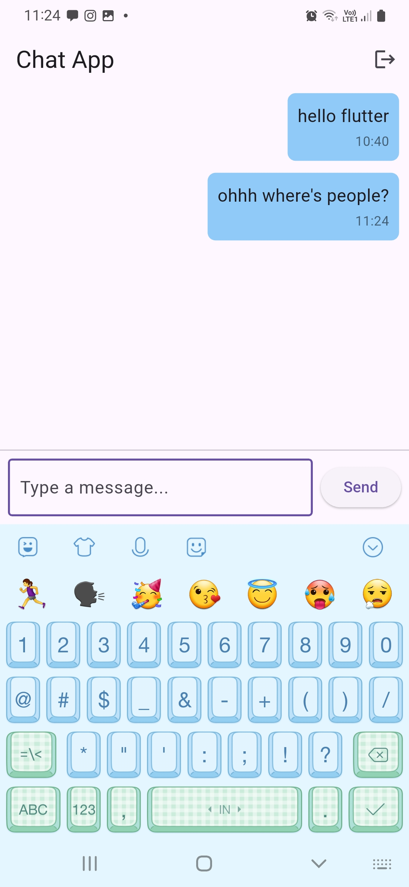
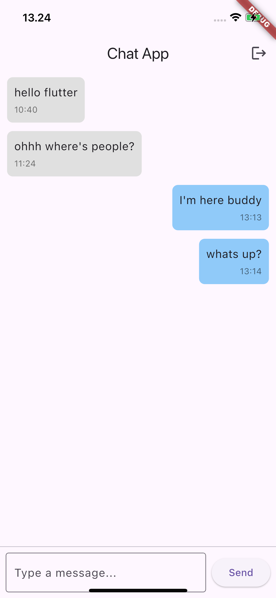

# 🗨️ Flutter Firebase Chat App

A cross-platform real-time chat application built with **Flutter** and **Firebase Realtime Database**. Supports **Anonymous Authentication** and works on both **Android** and **iOS**.

Created as part of a tutorial on [Djamware.com](https://www.djamware.com/post/68234cf2aa4c39421e27a61d/build-a-chat-app-with-flutter-and-firebase-realtime-database).




---

## ✨ Features

- 🔐 Anonymous user authentication (no login/signup required)
- 💬 Real-time messaging powered by Firebase Realtime Database
- 📲 Cross-platform support (iOS and Android)
- 📦 Simple, clean, and responsive Flutter UI
- ✅ Firebase SDK version `11.10.0`

---

## 📸 Screenshots

| iOS | Android |
|-----|---------|
|  |  |

---

## 🛠️ Getting Started

### 1. Clone the repo

```bash
git clone https://github.com/didinj/flutter-firebase-chat-app.git
cd flutter-firebase-chat-app

